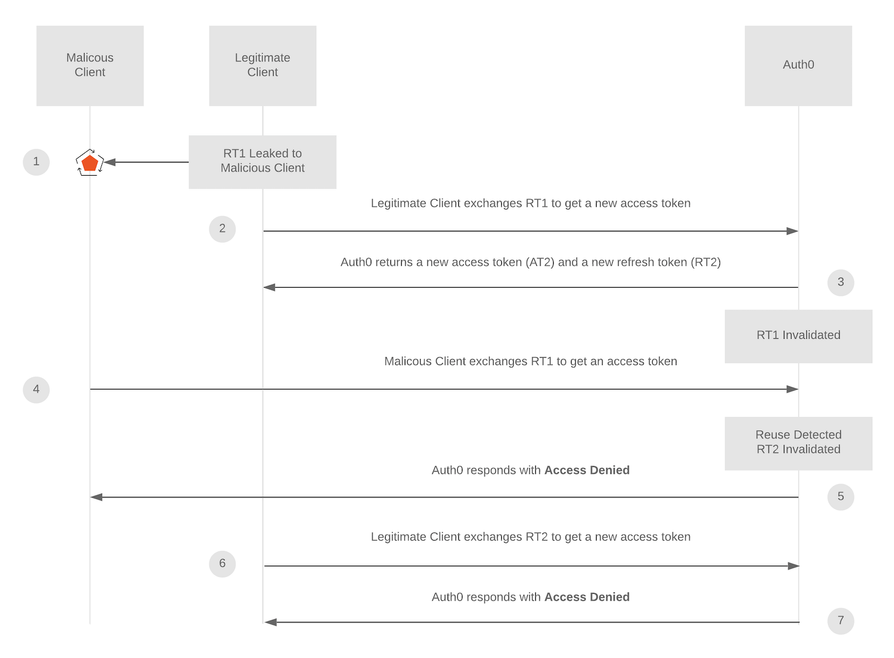
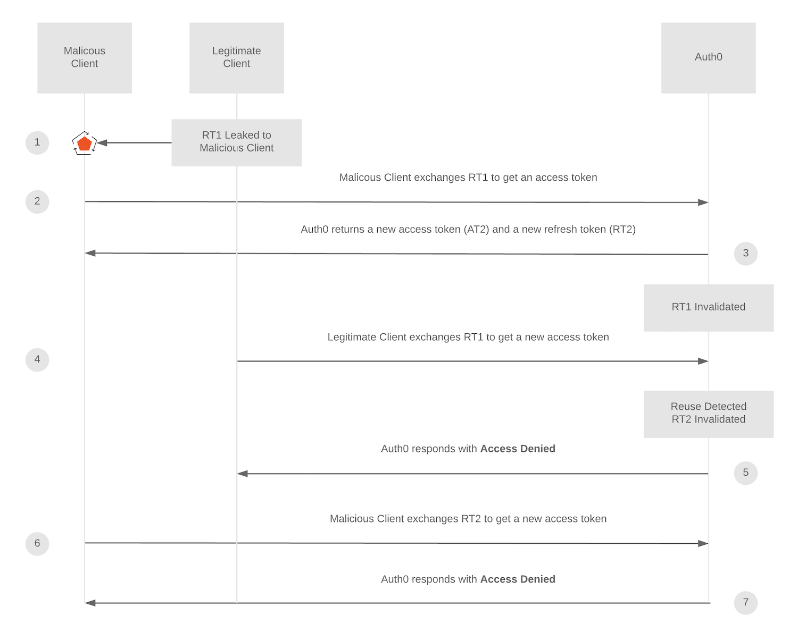

# nexauth

[![License][img-license]][lnk-license]
[![CI Status][img-github]][lnk-github]
[![Code Coverage][img-codecov]][lnk-codecov]
[![NPM Version][img-npm]][lnk-npm]

Strongly opinionated but dead simple and safe JWT-based authentication for Next.js framework.

_🗒️ Work and documentation in progress!_

---

- [Introduction](#introduction)
- [Get started](#get-started)
  - [Install](#install)
  - [Setup development environment](#setup-development-environment)
  - [Setup production environment](#setup-production-environment)
- [Tokens](#tokens)
  - [Access Token](#access-token)
  - [Refresh Tokens](#refresh-tokens)
- [Lifecycle](#lifecycle)
- [Security](#security)
  - [Automatic Reuse Detection](#automatic-reuse-detection)
- [Alternatives](#alternatives)
- [References](#references)

---

## Introduction

All tokens are signed (JWS) but **not** encrypted (JWE) JWTs.

Why? Because JWEs are only required when storing sensitive private information over non-secure connections,
which is something you should **never** do anyway [[1]][lnk-jwt-rfc-privacy].

The signing algorithm uses EdDSA elliptic curve in its Ed448 variant [[2]][lnk-curve448] [[3]][lnk-ed25517-vs-ed448].

The EdDSA key pair is consumed through environment variables, namely:

- `EDDSA_PRIVATE_KEY`: Only available within back-end applications.
- `NEXT_PUBLIC_EDDSA_PUBLIC_KEY`: Available within both back-end and front-end applications.

## Get started

### Install

```sh
npm i -E nexauth
```

or:

```sh
yarn add -E nexauth
```

### Setup development environment

At the root of your project, run:

```sh
npx nexauth init
```

which will generate and inject both `EDDSA_PRIVATE_KEY` & `NEXT_PUBLIC_EDDSA_PUBLIC_KEY` environment variables
within your `.env` file.

### Setup production environment

You'll need the same enviroment variables in production but **DON'T USE YOUR LOCAL VALUES IN PRODUCTION**.

Generate a new EdDSA key pair for that, by running:

```sh
npx nexauth generate
```

## Tokens

### Access Token

- **Brief:** Allow an application to access an API protected route.
- **Usage:** Sent via the `Authorization` header within any API request requiring an authentication.
- **Storage:** It should **NEVER** be stored.
- **Representation:** `JWS`
- **Lifetime:** `1200` (= 20 minutes in seconds)
<!-- - **Algorithm:** `RS256` -->
- **Payload:**

  ```ts
  {
    /** Expiration date */
    exp: number // Unix time (in seconds)
    /** Creation date */
    iat: number // Unix time (in seconds)
    /** Token CUID */
    jti: string
    /** User CUID */
    uid: string
    /** Custom non-sensitive user information, ie: */
    data: {
      email?: string
      firstName?: string
      lastName?: string
      role?: string
      scopes?: string[]
      // ...
    }
  }
  ```

### Refresh Tokens

- **Brief:** ...
- **Usage:** Sent to `/auth/refresh` within the body of a `POST` request each time the Access Token expires.
- **Storage:** [LocalStorage](https://developer.mozilla.org/en-US/docs/Web/API/Window/localStorage).
- **Representation:** `JWS`
- **Lifetime:** `1200` (= 20 minutes in seconds)
- **Payload:**

  ```ts
  {
    /** Expiration date */
    exp: number // Unix time (in seconds)
    /** Creation date */
    iat: number // Unix time (in seconds)
    /** Token CUID */
    jti: string
    /** User CUID */
    uid: string
    data: {
      /** Refresh Token Family CUID */
      familyId: string
    }
  }
  ```

## Lifecycle

```txt
┌─────┐                                                                  ┌─────┐
│ APP │                                                                  │ API │
└──┬──┘                                                                  └──┬──┘
   │                                                                        │
   │ POST /api/auth/login                                                   │
   │ {                                                                      │
   │   email: "..."                                                         │
   │   password: "..."                                                      │
   │ }                                                                      │
 1 ├───────────────────────────────────────────────────────────────────────►│
   │                                                                        │
   │                                   New Access Token + New Refresh Token │
   │◄───────────────────────────────────────────────────────────────────────┤ 2
   │                                                                        │
   │                                                                        │
 3 ├──┐                                                                     │
   │  │ Store Refresh Token in Local Storage                                │
   │◄─┘                                                                     │
   │                                                                        │
   │ Send authenticated requests with header:                               │
   │ {                                                                      │
   │   Authorization: "Bearer [ACCESS_TOKEN]"                               │
   │ }                                                                      │
 4 ├───────────────────────────────────────────────────────────────────────►│
   │                                                                        │
   │                                                                        │
┌──┴────────────────────────────────────────────────────────────────────────┴──┐
│                         Access Token expires                                 │
└──┬────────────────────────────────────────────────────────────────────────┬──┘
   │                                                                        │
   │ POST /api/auth/refresh                                                 │
   │ {                                                                      │
   │   refreshToken: "[REFRESH_TOKEN]"                                      │
   │ }                                                                      │
   ├───────────────────────────────────────────────────────────────────────►│
   │                                                                        │
   │                                                                        │
   │                                   New Access Token + New Refresh Token │
   │◄───────────────────────────────────────────────────────────────────────┤
   ⁞                                                                        ⁞
```

## Security

### Automatic Reuse Detection

**nexauth** follows the same principles than [auth0][lnk-automatic-reuse-detection] ones.





## Alternatives

**nexauth** is very opinionated for the sake of simplifying authentication covering SSR-generated, SPAs and
API-based split applications. It's not intented to compete with more largely used authentication libraries as:

- [NextAuth.js](https://next-auth.js.org/)
- [Passport.js](https://www.passportjs.org/)
- [auth0](https://auth0.com/)
- [iron-session](https://github.com/vvo/iron-session)

Don't hesitate to use these libraries instead of **nexauth** if they're a better fit for your use-case.

## References

- [What Are Refresh Tokens and How to Use Them Securely](https://auth0.com/blog/refresh-tokens-what-are-they-and-when-to-use-them/)
- [How to select a JOSE / JWT cryptographic algorithm for your application](https://connect2id.com/products/nimbus-jose-jwt/algorithm-selection-guide)
- [JWTs: Which Signing Algorithm Should I Use?](https://www.scottbrady91.com/jose/jwts-which-signing-algorithm-should-i-use)
- [Cipher Suites Demystified](https://joehonton.medium.com/cipher-suites-demystified-ada2e97be9c9)
- [Token Best Practices](https://auth0.com/docs/best-practices/token-best-practices)

---

[img-codecov]: https://img.shields.io/codecov/c/github/betagouv/nexauth/main?style=flat-square
[img-github]: https://img.shields.io/github/workflow/status/betagouv/nexauth/Check/main?style=flat-square
[img-license]: https://img.shields.io/github/license/betagouv/nexauth?style=flat-square
[img-npm]: https://img.shields.io/npm/v/nexauth?style=flat-square
[lnk-codecov]: https://codecov.io/gh/betagouv/nexauth/branch/main
[lnk-github]: https://github.com/betagouv/nexauth/actions?query=branch%3Amain++
[lnk-license]: https://github.com/betagouv/nexauth/blob/main/LICENSE
[lnk-npm]: https://www.npmjs.com/package/nexauth

[lnk-curve448]: https://en.wikipedia.org/wiki/Curve448
[lnk-ed25517-vs-ed448]: https://crypto.stackexchange.com/a/67468/52638
[lnk-jwt-rfc-privacy]: https://www.rfc-editor.org/rfc/rfc7519#section-11.2
[lnk-automatic-reuse-detection]: https://auth0.com/docs/security/tokens/refresh-tokens/refresh-token-rotation#automatic-reuse-detection
