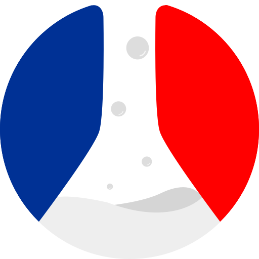

  
  <h1 align="center">nexauth</h1>

  <a aria-label="beta.gouv.fr logo" href="https://beta.gouv.fr" rel="noreferrer" target="_blank">
    <img src="https://img.shields.io/badge/MADE%20BY%20beta.gouv.fr-fff.svg?style=for-the-badge&color=21304d&labelColor=000&logo=data:image/svg+xml;base64,PHN2ZyB3aWR0aD0iNTEyIiBoZWlnaHQ9IjUxMiIgZGF0YS1uYW1lPSJMYXllciAxIiB2ZXJzaW9uPSIxLjEiIHZpZXdCb3g9IjAgMCA0ODAgNDgwIiB4bWxucz0iaHR0cDovL3d3dy53My5vcmcvMjAwMC9zdmciPgogPGRlZnM+CiAgPGNsaXBQYXRoIGlkPSJnIj4KICAgPHJlY3QgeD0iNDgzLjkyIiB5PSIyMjQuNDIiIHdpZHRoPSIxOC42MDYiIGhlaWdodD0iMTYuNTQyIiBmaWxsPSJub25lIiBvcGFjaXR5PSIuMTI3IiBzdHJva2U9IiNmZmYiIHN0cm9rZS1vcGFjaXR5PSIuNzAyMzgiIHN0cm9rZS13aWR0aD0iMi4zODMiLz4KICA8L2NsaXBQYXRoPgogIDxjbGlwUGF0aCBpZD0iZiI+CiAgIDxyZWN0IHg9IjQ4My45MiIgeT0iMjI0LjQyIiB3aWR0aD0iMTguNjA2IiBoZWlnaHQ9IjE2LjU0MiIgZmlsbD0ibm9uZSIgb3BhY2l0eT0iLjEyNyIgc3Ryb2tlPSIjZmZmIiBzdHJva2Utb3BhY2l0eT0iLjcwMjM4IiBzdHJva2Utd2lkdGg9IjIuMzgzIi8+CiAgPC9jbGlwUGF0aD4KICA8Y2xpcFBhdGggaWQ9ImQiPgogICA8cmVjdCB4PSI0ODMuOTIiIHk9IjIyNC40MiIgd2lkdGg9IjE4LjYwNiIgaGVpZ2h0PSIxNi41NDIiIGZpbGw9Im5vbmUiIG9wYWNpdHk9Ii4xMjciIHN0cm9rZT0iI2ZmZiIgc3Ryb2tlLW9wYWNpdHk9Ii43MDIzOCIgc3Ryb2tlLXdpZHRoPSIyLjM4MyIvPgogIDwvY2xpcFBhdGg+CiAgPGNsaXBQYXRoIGlkPSJlIj4KICAgPHJlY3QgeD0iNDgzLjkyIiB5PSIyMjQuNDIiIHdpZHRoPSIxOC42MDYiIGhlaWdodD0iMTYuNTQyIiBmaWxsPSJub25lIiBvcGFjaXR5PSIuMTI3IiBzdHJva2U9IiNmZmYiIHN0cm9rZS1vcGFjaXR5PSIuNzAyMzgiIHN0cm9rZS13aWR0aD0iMi4zODMiLz4KICA8L2NsaXBQYXRoPgogIDxjbGlwUGF0aCBpZD0iYyI+CiAgIDxjaXJjbGUgY3g9IjQ2Ny4yNiIgY3k9IjM5MC41MiIgcj0iMjcxLjA4IiBmaWxsPSIjMGYwIiBmaWxsLW9wYWNpdHk9Ii40OTQwNSIgZmlsbC1ydWxlPSJldmVub2RkIiBzdHJva2U9IiMwMDAiIHN0cm9rZS13aWR0aD0iMS4wMTI0cHgiLz4KICA8L2NsaXBQYXRoPgogIDxjbGlwUGF0aCBpZD0iYiI+CiAgIDxjaXJjbGUgY3g9IjQ5MS45NCIgY3k9IjM0Mi41IiByPSIxOTguNDciIGZpbGw9IiMwZjAiIGZpbGwtb3BhY2l0eT0iLjQ5NDA1IiBmaWxsLXJ1bGU9ImV2ZW5vZGQiIHN0cm9rZT0iIzAwMCIgc3Ryb2tlLXdpZHRoPSIuNzQxMjVweCIvPgogIDwvY2xpcFBhdGg+CiAgPGNsaXBQYXRoIGlkPSJhIj4KICAgPGNpcmNsZSBjeD0iNDkxLjk0IiBjeT0iMzQyLjUiIHI9IjE5OC40NyIgZmlsbD0iIzBmMCIgZmlsbC1vcGFjaXR5PSIuNDk0MDUiIGZpbGwtcnVsZT0iZXZlbm9kZCIgc3Ryb2tlPSIjMDAwIiBzdHJva2Utd2lkdGg9Ii43NDEyNXB4Ii8+CiAgPC9jbGlwUGF0aD4KIDwvZGVmcz4KIDx0aXRsZT5iZXRhLmdvdXYuZnI8L3RpdGxlPgogPGcgdHJhbnNmb3JtPSJtYXRyaXgoLjMxNTY5IDAgMCAuMzE1NjkgLTkyLjY0MyAtNDguMTI0KSI+CiAgPGNpcmNsZSBjeD0iMTA1My43IiBjeT0iOTEyLjY5IiByPSI3NjAuMjUiIGZpbGw9IiNmZmYiIHN0cm9rZS13aWR0aD0iMi45NjMyIi8+CiAgPGcgdHJhbnNmb3JtPSJtYXRyaXgoMi44MDQ1IDAgMCAyLjgwNDUgLTI1NS42OCAtMTgyLjU0KSIgY2xpcC1wYXRoPSJ1cmwoI2MpIj4KICAgPHBhdGggZD0ibTM2MS42IDU1NC4zN3MxMTMuNTgtMi44NTg4IDE3MS0zMC41M2MzOC42NS0xOC42MjUgNzIuMjYyLTE3Ljk3IDg4LjQ5MSAxMi4xNjUgOC4zMzQ5IDE1LjQ3Ny0yMS4zMTEgNTIuOTY1LTg2LjQ1MSA1Ny4wODUtNjUuMTQgNC4xMi0xNzMuMDQtMzguNzItMTczLjA0LTM4LjcyeiIgY2xpcC1wYXRoPSJub25lIiBvcGFjaXR5PSIuMTY3Ii8+CiAgIDxwYXRoIGQ9Im0zMTQuODMgNTMyLjIxYy0zNS41MDcgNDguMzQtNTUuMDk4IDc1LjY5Mi01NC4zMTQgNzUuMDgyIDMxLjg4OS0yNC44MDMgMTMzLjA3IDkzLjU3MSAyMDAuMjYgOTQuODU0IDc5Ljg3NSAxLjUyNSAyNDMuMzctNTQuNDA4IDIxNS4zMS05Mi4zNThsLTU3LjE5OS03Ny4zNDdzLTU4LjMzNiA2My44MTUtMTk3LjggMTAuODk1YzAgMC4wNC03MC42MzgtMTcuMjM2LTEwNi4yNi0xMS4xMjZ6IiBjbGlwLXBhdGg9Im5vbmUiIGZpbGw9IiNlZWUiLz4KICA8L2c+CiAgPGcgZmlsbD0iI2RkZCIgZmlsbC1ydWxlPSJldmVub2RkIj4KICAgPGVsbGlwc2UgY3g9Ijk4OS40MiIgY3k9Ijc5MS43NyIgcng9IjQ0LjYwNiIgcnk9IjQ0LjYwNiIvPgogICA8ZWxsaXBzZSBjeD0iMTEwMS4xIiBjeT0iNDMzLjg2IiByeD0iNjYuMzA1IiByeT0iNjcuNDc1Ii8+CiAgIDxlbGxpcHNlIGN4PSIxMTU1LjMiIGN5PSIxMTAxLjMiIHJ4PSIzMC4wOTgiIHJ5PSIzMC4wOTgiLz4KICAgPGVsbGlwc2UgY3g9IjkzOC41MiIgY3k9IjEyNDcuOSIgcng9IjE4IiByeT0iMTgiLz4KICA8L2c+CiAgPGcgZmlsbD0ibm9uZSIgc3Ryb2tlPSIjZmZmIiBzdHJva2Utb3BhY2l0eT0iLjcwMjM4IiBzdHJva2Utd2lkdGg9IjMiPgogICA8Y2lyY2xlIHRyYW5zZm9ybT0ibWF0cml4KDIuMDk4NiAwIDAgMi41NDIzIDk3LjM2MSAtMTIwLjMxKSIgY3g9IjQ4NC41MiIgY3k9IjIxOS40MiIgcj0iMTYuNDM0IiBjbGlwLXBhdGg9InVybCgjZykiLz4KICAgPGNpcmNsZSB0cmFuc2Zvcm09Im1hdHJpeCgxLjU4OTYgMCAwIDEuNTg5NiAyMjAuNTkgNDQ5LjA0KSIgY3g9IjQ4NC41MiIgY3k9IjIxOS40MiIgcj0iMTYuNDM0IiBjbGlwLXBhdGg9InVybCgjZikiLz4KICAgPGNpcmNsZSB0cmFuc2Zvcm09Im1hdHJpeCguODg2MjMgMCAwIC44ODYyMyA1MDQuMDkgMTA0OS45KSIgY3g9IjQ4NC41MiIgY3k9IjIxOS40MiIgcj0iMTYuNDM0IiBjbGlwLXBhdGg9InVybCgjZCkiLz4KICAgPGNpcmNsZSB0cmFuc2Zvcm09Im1hdHJpeCgxLjE0MiAwIDAgMS4xNDIgNjAyLjggODUxLjA2KSIgY3g9IjQ4NC41MiIgY3k9IjIxOS40MiIgcj0iMTYuNDM0IiBjbGlwLXBhdGg9InVybCgjZSkiLz4KICA8L2c+CiAgPGcgdHJhbnNmb3JtPSJtYXRyaXgoMy44MzA1IDAgMCAzLjgzMDUgLTgzMC42NiAtNDAxLjM4KSIgY2xpcC1wYXRoPSJ1cmwoI2EpIiBmaWxsPSIjMDAzMTk1Ij4KICAgPHBhdGggZD0ibTQzMy42OSAxNTIuODhjMTIuMTIxLTIuNDA0NSAxOC41MTcgNy4zODI5IDE4LjMyOSAxOS41MjEgMCAwIDIuNTA0OCAxNDUuNjktNi42MDUxIDE3My45OS04LjIxMjQgMjUuNTEtNzguNzcxIDExOS45NS05Mi43MDggMTM4LjQ3LTM4LjIxOS0zNy4zNjItNTkuNzY5LTg4LjU0OS01OS43ODItMTQyIDAuMDE5MS04Ny4zOTcgNTcuMTYtMTY0LjUxIDE0MC43Ny0xODkuOTh6IiBjbGlwLXBhdGg9Im5vbmUiIGZpbGwtcnVsZT0iZXZlbm9kZCIvPgogICA8cGF0aCBkPSJtNDMzLjg0IDE1Mi41MS00MzQuNzQgMC4zNjY3OHYzMzMuMzlsMzUzLjYzLTEuNDM1OHoiLz4KICA8L2c+CiAgPGcgdHJhbnNmb3JtPSJtYXRyaXgoMy44MzA1IDAgMCAzLjgzMDUgLTgzMC42NiAtNDAxLjM4KSIgY2xpcC1wYXRoPSJ1cmwoI2IpIiBmaWxsPSIjZjAwIj4KICAgPHBhdGggZD0ibTU1MC4xMiAxNTIuODFjLTEyLjI3NC0xLjc5MzgtMTguNTE3IDcuMzgyOS0xOC4zMjkgMTkuNTIxIDAgMC0yLjUwNDggMTQ1LjY5IDYuNjA1MSAxNzMuOTkgOC4yMTI0IDI1LjUxIDc4Ljc3MSAxMTkuOTUgOTIuNzA4IDEzOC40NyAzOC4yMTktMzcuMzYyIDU5Ljc2OS04OC41NDkgNTkuNzgyLTE0Mi0wLjAxOTEtODcuMzk3LTU3LjE2LTE2NC41MS0xNDAuNzctMTg5Ljk4eiIgZmlsbC1ydWxlPSJldmVub2RkIi8+CiAgIDxwYXRoIGQ9Im01NDYuNTkgMTUyLjQ0IDQ0MC44NSAwLjM2Njc3djMzMy4zOWwtMzU2LjI5LTEuNDM3M3oiLz4KICA8L2c+CiA8L2c+Cjwvc3ZnPgo=">
  </a>
  
  
  

---

> A dead simple JWT-based authentication library for Next.js framework.

⚠️ _Work and documentation in progress!_

## Getting Started

Visit [https://betagouv.github.io/nexauth/#/install][lnk-install] to get started with nexauth.

## Documentation

Visit [https://betagouv.github.io/nexauth/][lnk-documentation] to view the full documentation.

## Contributing

Please see our [CONTRIBUTING.md](/CONTRIBUTING.md).

---

[lnk-documentation]: https://betagouv.github.io/nexauth/
[lnk-install]: https://betagouv.github.io/nexauth/#install
