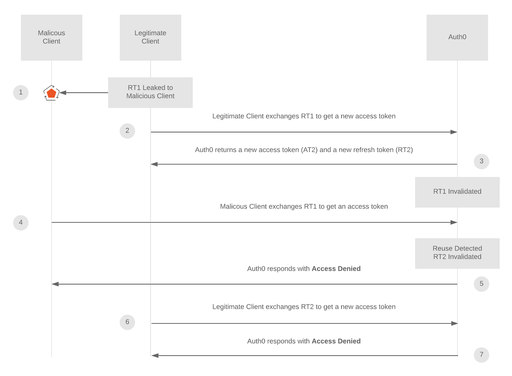

# Automatic Reuse Detection

**nexauth** follows the same principles than **auth0** ones [[1]][lnk-automatic-reuse-detection].

# Case A

# Case B

---

[lnk-automatic-reuse-detection]: https://auth0.com/docs/security/tokens/refresh-tokens/refresh-token-rotation#automatic-reuse-detection ':target=_blank'
